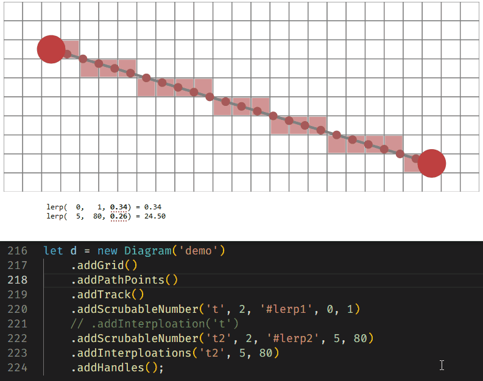
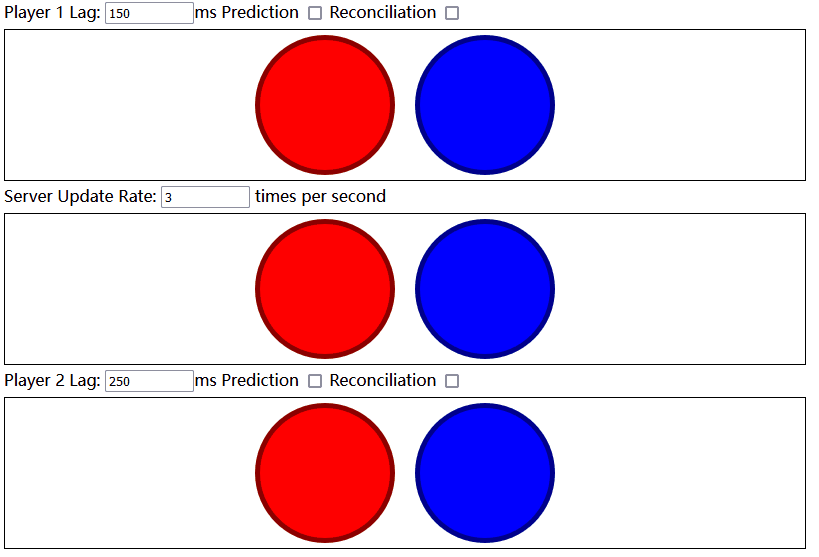

1. LineDrawingTutorial: [Making of: Line drawing tutorial](https://www.redblobgames.com/making-of/line-drawing/)

2. Multiplayer Network: [Fast-Paced Multiplayer](https://www.gabrielgambetta.com/client-server-game-architecture.html)

可以看到
1. 未选择Prediction和Reconciliation时, 服务端的状态首先发生改变, 然后广播至客户端, 进行展示
2. 选择Prediction后, 本地的*预测状态*不断与服务器延迟发来的*权威状态*冲突, 需要来回调整(抖动)
3. 选择Reconciliation后, 本地的状态与服务器的状态一直是一致的

现在还剩一个问题, 就是当player 1移动时, 在player 2的视角中, player 1的位置是突变的, 在server update rate低的时候会更明显, 解决这个问题可以在收到不属于自己的移动时, 对相应entity的状态转变进行插值

